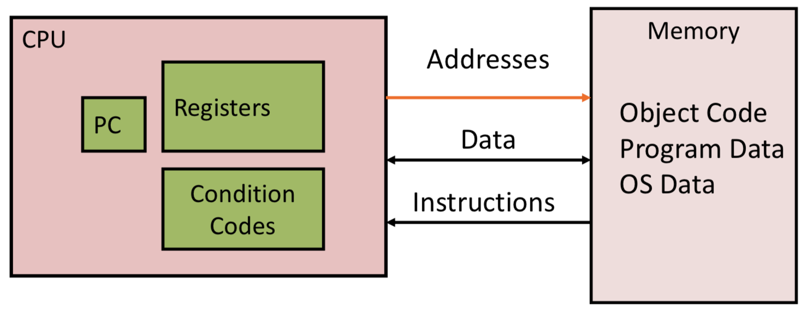

## Introduction to Assembly
Assembly is a low-level language for telling a CPU what to do with data.

#### Two Syntaxes
x86 assembly language has two main syntax branches: Intel syntax, originally used for documentation of the x86 platform, and AT&T syntax. Intel syntax is dominant in the MS-DOS and Windows world, and AT&T syntax is dominant in the Unix world, since Unix was created at AT&T Bell Labs. **This will focus on the AT&T syntax**.

#### Data Types
* "Integer" data of 1,,2, or 4 bytes - can be data or address
* Floating point data of 4,8, or 10 bytes
* Numbers are represented as `$NUM`, where `NUM` is a number

#### Registers
* The CPU doesn't keep track of all of memory at once - instead, information is stored in registers
* These are the 'variables' of assembly - only have 16
* Registers can hold either memory addresses or values
	- 8 Consecutive bytes of memory
	- 64-bit value (or 32-bit value for a 32-bit processor)
- Represented as `%REG`, where `REG` is the name of a register

C Declaration 	| Intel Data Type  	| Size (bytes)
 --- 			| ---				| ---
Char 			| Byte 				| 1
Short 			| Word 				| 2
Int 			| Double Word 		| 4
Long 			| Quad Word 		| 8
Pointer 		| Quad Word 		| 8

#### Three Operation Types
* Perform arithmetic on data (add, subtract, multiply, etc.)
* Transfer data between memory and register
	- Load data from memory into register
	- Store register data into memory
- Transfer control
	- Unconditional jumps to/from procedures
	- Conditional branches

Document written using slides from Professor Zahran's CSCI 201 class.
